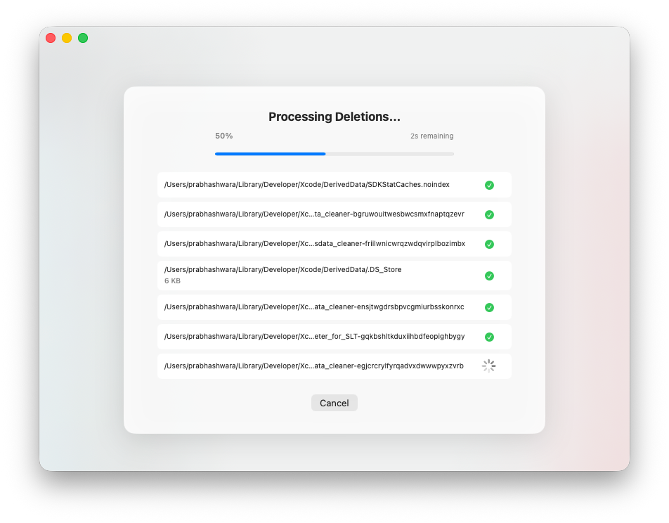
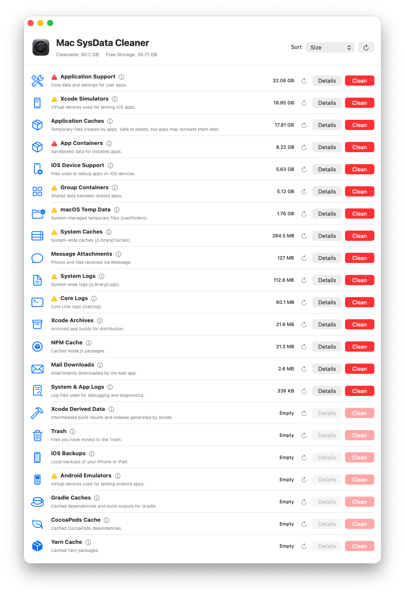
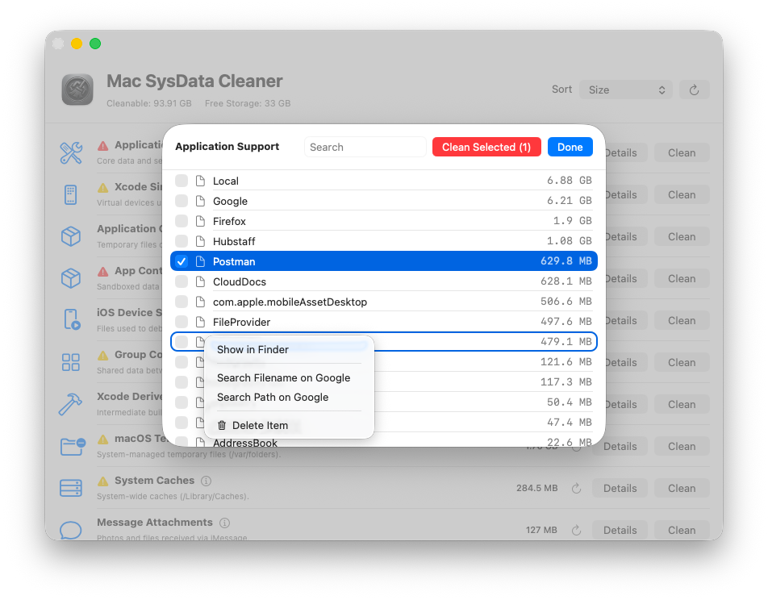
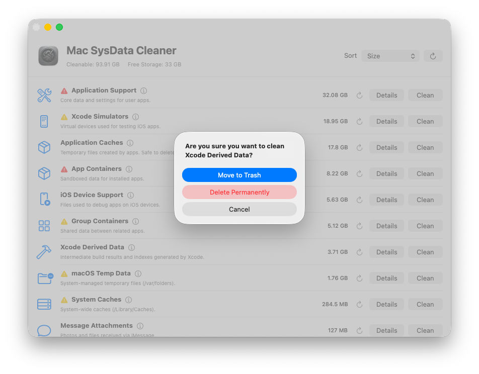

# Mac System Data Cleaner

This tool was built out of a bad choice: buying a 256GB Mac. After a while, macOS "System Data" started eating up over 100GB of that tiny drive, leading to a desperate need to get the space back.

Despite many users having this issue, finding a reliable tool on the internet proved impossible. The only available solutions were scattered terminal commands, and constantly bookmarking them became exhausting.

It turns out macOS holds onto bloated system caches, hidden files, and a ton of junk from apps uninstalled years ago. This app was created to track down all of this hidden System Data and give you actual control over cleaning it up.

## What it does

### Clean up everywhere
Scan your drive to find large, hidden, or leftover files from apps you don't even use anymore. You'll probably be surprised by what's still taking up space.

### Find and research files
List, search, and look through your files. If you find a weirdly named file and aren't sure if it's safe to delete, there's a quick Google search button so you can figure out what it does first.

### Move to Trash safely
Instead of permanently deleting files right away and hoping your Mac still boots, you can just move them to the Trash. You can test if anything breaks, and if it does, just put the files back.

---
*Note: Use this tool carefully. Always research files if you don't know what they are, and rely on the Trash feature to be safe.*
